# This is my investment journal program.

### The program provides a simple user interface that allows you to
-   use a menu-based console interface and a menu-based GUI with easy IO operations
-   handle multiple accounts
-   record the account information and trading history
-   update stock data from web APIs
-   visualize the stock data as well as some other account information
-   obtain suggestions from various trading strategies
-   get notified when a trade point is triggered
-   evaluate the effectiveness of each strategy through simulations


###     Requirement:
####    Python > 3.7
####    Libraries:
```
matplotlib==3.7.1
pandas==2.0.3
pygame==2.6.1
Requests==2.32.3
scikit_learn==1.5.2
tqdm==4.66.4
xgboost==2.1.1
```

for plotting in a Linux environment:
```
PyQt5==5.15.10
PyQt5_sip==12.13.0
```

### Demo:

####    Startup
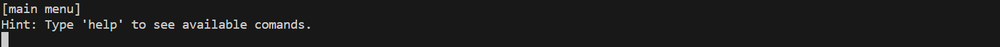

####    Get helps

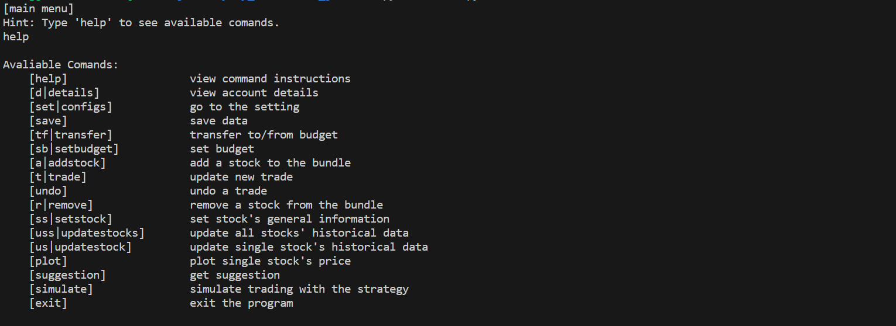
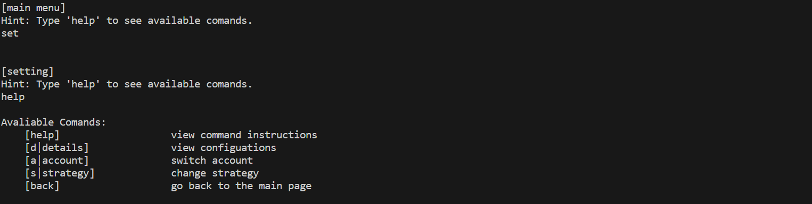

####    View configurations and create/switch an account
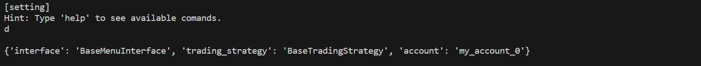
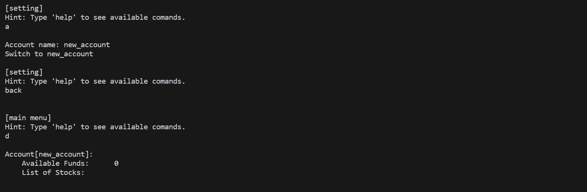


####   Set account budget, transfer, add stock & make a trade
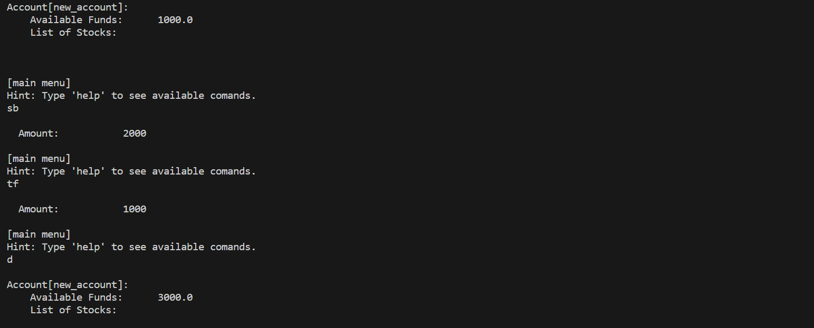
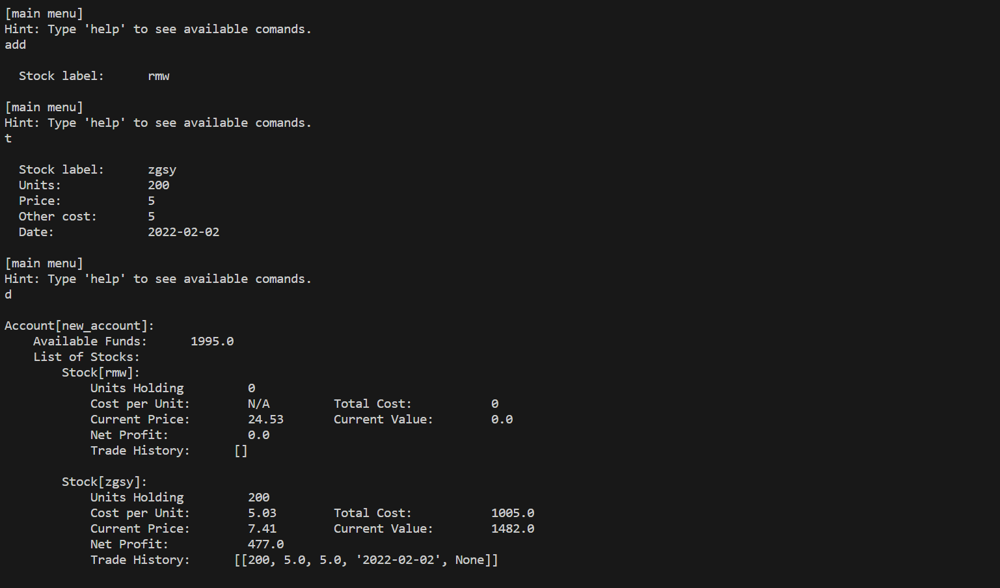


####    Undo & remove a stock
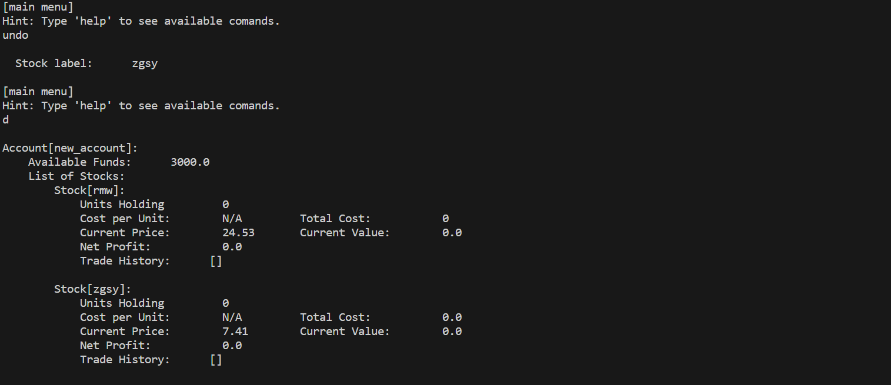
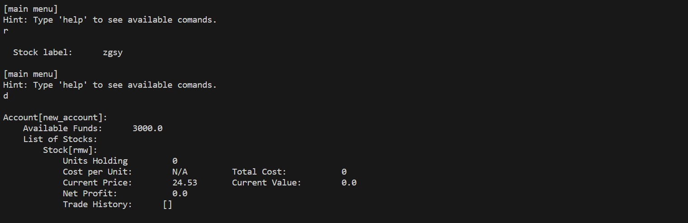


####    Set stock's code & request stock data from internet
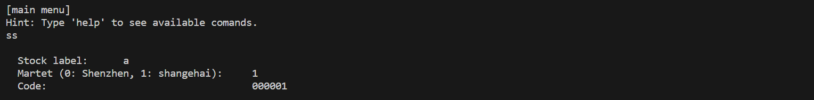
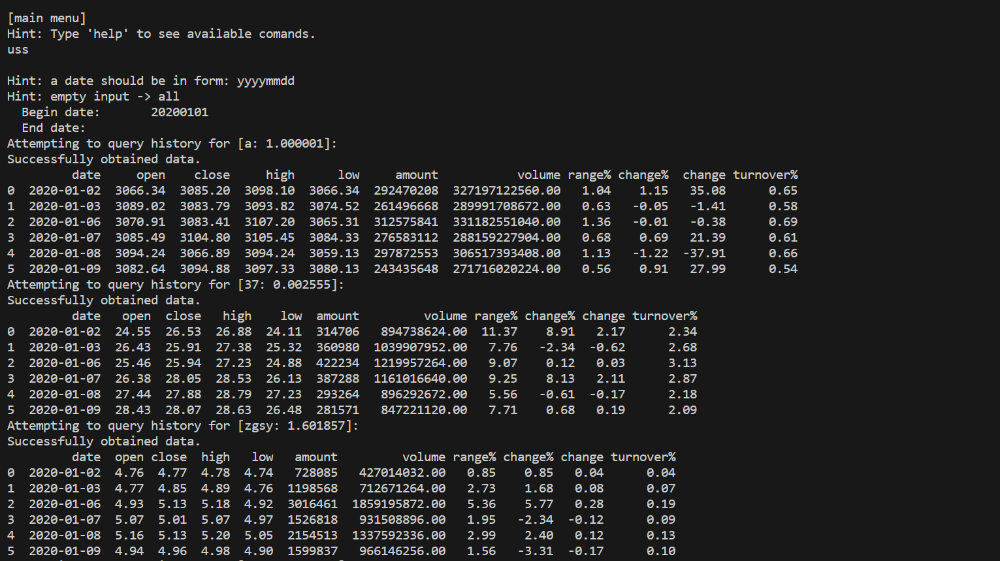


####    Plot stock price
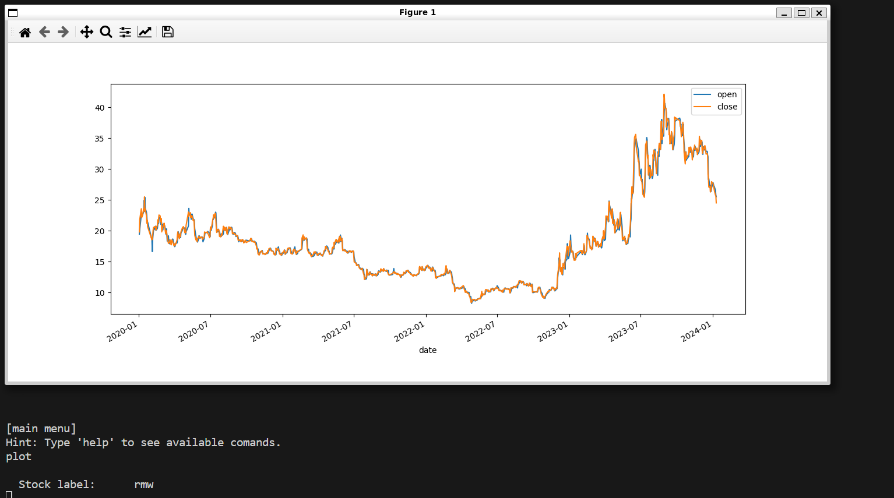


####    Get suggestion
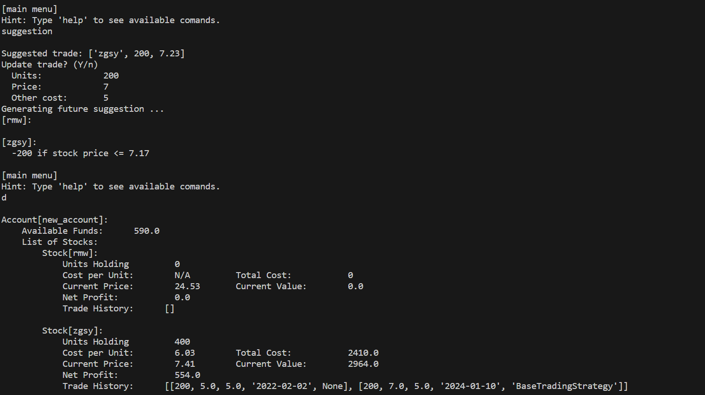
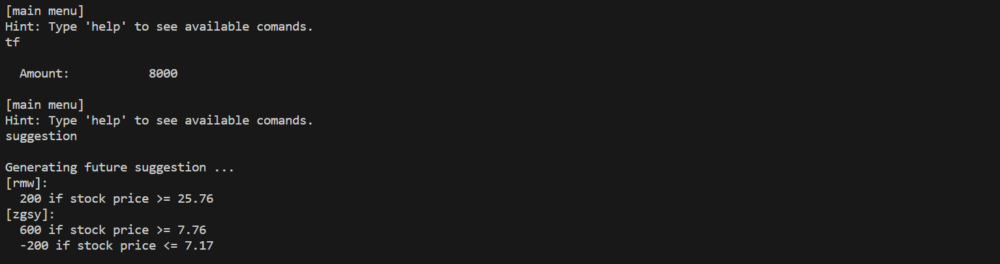


#### Ivan Zeng ;)
